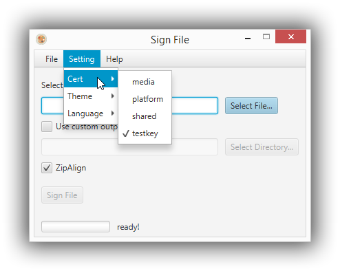

# SignApk #

### Introduction ###

This is a simple cross-platform small app for sign apk, jar or zip file. You can optional select a output directory or use the default location where the file resides.

### Features ###

- optional configure output directory
- drag and drop support(drag intput and output)
- zipalign support
- support runtime language switch
- support runtime theme switch

### some snapshot ###
The main window

